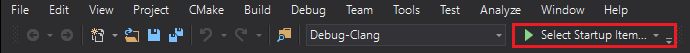

# Requirements

- The *latest* [Clang/LLVM](http://releases.llvm.org/download.html) release.
- The [Vulkan SDK](https://vulkan.lunarg.com/sdk/home) release *v1.1.73.0* (**Only for Debug Mode**).

# Setup

This project compiles using CMake.

## How to use on Visual Studio:

- Execute **launch_vs_generator.bat** located in the *root folder* (**don't move it, it uses relative paths to work**) (*should only be necessary the first time you clone the project*)

- Open the *root folder* in Visual Studio.

- Select your desired *compilation mode* (**Debug-Clang** or **Release-Clang**):

  

- Select your *target*. Currently, you can choose between compiling the *Engine* or the *Editor* (resulting in compiling both the *Engine* and the *Editor*). There is two associated targets for each of them: one for the *Debug* mode and one for the *Release* mode.

  (Ex: I want to compile the Editor in *Debug* mode. Therefore, I will select **Debug-Clang** as *compilation mode* and **Editor - Debug** as *target*)

  

- Build.

# Troubleshooting

## "Unable to start debugging" message

Follow the first step of *How to use on Visual Studio:* again and restart visual studio just in case.

## "Definition with same mangled name as another definition" error/No error at all but not successfully compiling

This is a bug from clang that may happen when passing functions as template parameters. We use this feature a lot for our lua wrapper (based on [luwra](https://github.com/vapourismo/luwra)) so it might have some trouble compiling everything at once. Just *resume* the compilation as long as necessary.